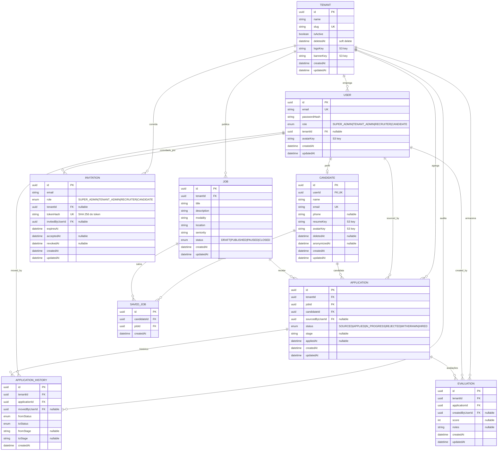
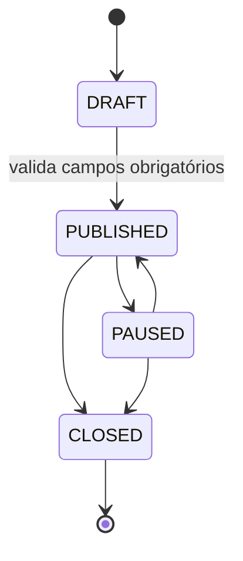
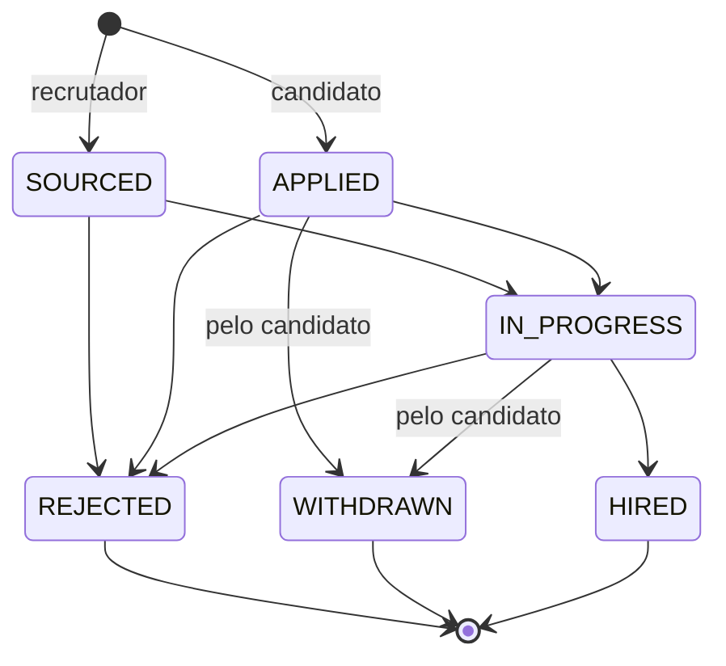

# Modelo de Dados

> **Navegação:** [Visão geral](./README.md) · [Funcionalidades e Regras de Negócio](./FUNCIONALIDADES.md) · **Modelo de Dados**

Diagrama do banco de dados PostgreSQL gerido pelo Prisma. O schema vive em `api/prisma/schema/*.prisma` e está particionado por agregado (`tenants`, `users`, `candidates`, `jobs`, `applications`, `evaluations`).

## Diagrama ER

## Constraints e índices relevantes

| Tabela | Constraint | Notas |
|---|---|---|
| `tenants` | `slug` único | usado nas URLs públicas de carreiras |
| `users` | `email` único | login global |
| `users` | FK `tenantId` `ON DELETE SET NULL` | candidato/super admin não têm tenant |
| `candidates` | `userId` único | `1..1` com `User` (*one profile*) |
| `candidates` | `email` único | independente do utilizador |
| `applications` | único `(tenantId, jobId, candidateId)` | impede duplicar candidatura |
| `applications` | FK `sourcedByUserId` `ON DELETE SET NULL` | autor do *sourcing* opcional |
| `application_history` | FK `movedByUserId` `ON DELETE SET NULL` | preserva histórico mesmo se o utilizador for removido |
| `evaluations` | FK `createdByUserId` `ON DELETE SET NULL` | preserva avaliações órfãs |
| `saved_jobs` | único `(candidateId, jobId)` | sem duplicados de favoritos |
| `invitations` | `tokenHash` único | impede colisões e permite lookup directo pelo token recebido por email |
| `invitations` | FK `tenantId` `ON DELETE CASCADE` | apagar a empresa invalida convites pendentes |
| `invitations` | FK `invitedByUserId` `ON DELETE SET NULL` | mantém auditoria mesmo após remoção do autor |

Todas as FKs para `Tenant`, `Job`, `Candidate` e `Application` propagam com `ON DELETE CASCADE`; apagar um tenant remove o seu universo de dados (vagas, candidaturas, histórico, avaliações).

## Ciclo de vida: Vagas (`Job.status`)

Transições permitidas só pelo use case de mudança de status. A passagem para `PUBLISHED` exige `title`, `description`, `modality`, `location` e `seniority` não vazios. `CLOSED` é terminal.

## Ciclo de vida: Candidaturas (`Application.status`)

Toda transição grava entrada em `ApplicationHistory` com `fromStatus`/`toStatus`, `fromStage`/`toStage` e o `movedByUserId` que executou a ação. Estados `REJECTED`, `WITHDRAWN` e `HIRED` são terminais.

## Isolamento por tenant

Além das FKs explícitas, o Prisma client é estendido para injetar/limitar `tenantId` nas queries de `Job`, `Application`, `ApplicationHistory` e `Evaluation` quando o contexto está definido em `AsyncLocalStorage`. Funciona como rede de segurança caso um use case esqueça o filtro.
