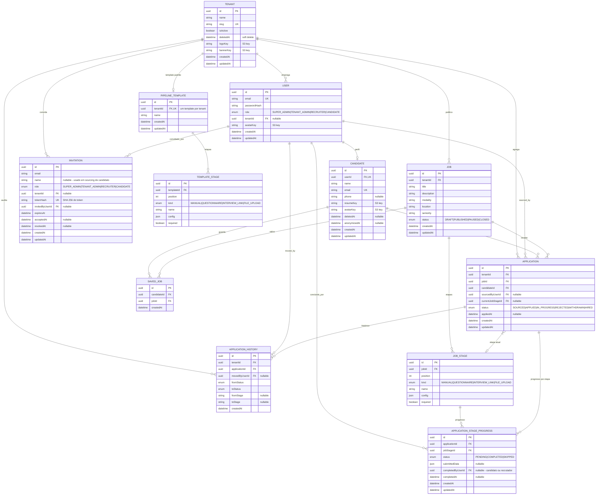
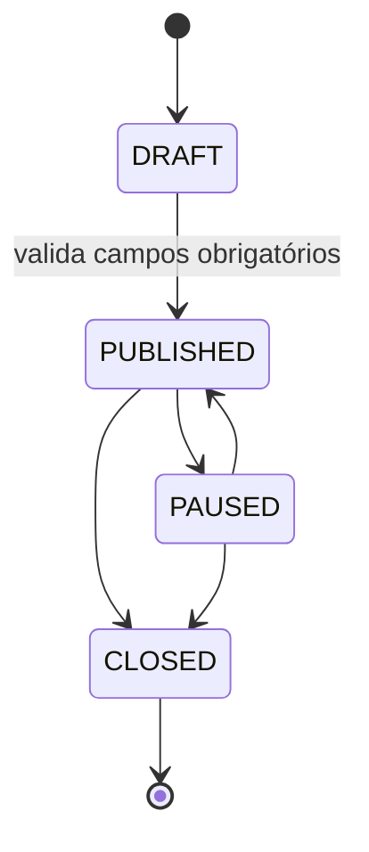
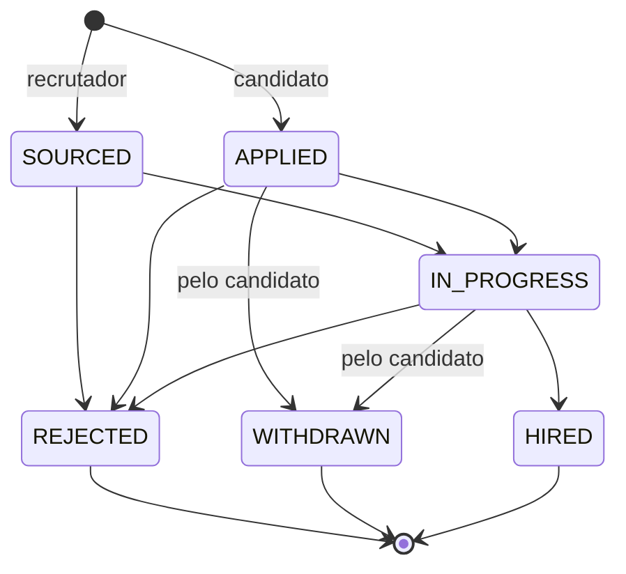
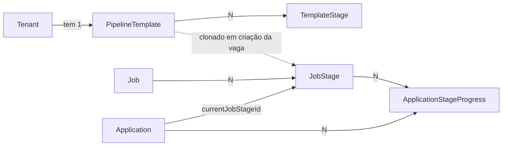

# Modelo de Dados

> **Navegação:**
> - [Visão geral](./README.md)
> - [Funcionalidades e Regras de Negócio](./FUNCIONALIDADES.md)
> - **Modelo de Dados**
> - [Fluxos](./FLUXOS.md)

Diagrama do banco de dados PostgreSQL gerido pelo Prisma. O schema vive em `api/prisma/schema/*.prisma` e está particionado por agregado (`tenants`, `users`, `candidates`, `jobs`, `applications`, `pipelines`).

## Diagrama ER

## Constraints e índices relevantes

| Tabela | Constraint | Notas |
|---|---|---|
| `tenants` | `slug` único | usado nas URLs públicas de carreiras |
| `users` | `email` único | login global |
| `users` | FK `tenantId` `ON DELETE SET NULL` | candidato/super admin não têm tenant |
| `candidates` | `userId` único | `1..1` com `User` (*one profile*) |
| `candidates` | `email` único | independente do usuário |
| `applications` | único `(tenantId, jobId, candidateId)` | impede duplicar candidatura |
| `applications` | FK `sourcedByUserId` `ON DELETE SET NULL` | autor do *sourcing* opcional |
| `application_history` | FK `movedByUserId` `ON DELETE SET NULL` | preserva histórico mesmo se o usuário for removido |
| `saved_jobs` | único `(candidateId, jobId)` | sem duplicados de favoritos |
| `invitations` | `tokenHash` único | impede colisões e permite lookup direto pelo token recebido por email |
| `invitations` | FK `tenantId` `ON DELETE CASCADE` | apagar a empresa invalida convites pendentes |
| `invitations` | FK `invitedByUserId` `ON DELETE SET NULL` | mantém auditoria mesmo após remoção do autor |
| `pipeline_templates` | `tenantId` único | um template por tenant; criado automaticamente quando consultado pela primeira vez |
| `template_stages` | único `(templateId, position)` | ordenação estável das etapas no template |
| `job_stages` | único `(jobId, position)` | clonagem do template no momento da criação da vaga |
| `applications` | FK `currentJobStageId` `ON DELETE SET NULL` | apagar uma etapa não destrói candidaturas; o cursor cai para nulo |
| `application_stage_progress` | único `(applicationId, jobStageId)` | um único progresso por etapa de cada candidatura |
| `application_stage_progress` | FK `completedByUserId` `ON DELETE SET NULL` | auditoria preservada após remoção do usuário |

Todas as FKs para `Tenant`, `Job`, `Candidate` e `Application` propagam com `ON DELETE CASCADE`; apagar um tenant remove o seu universo de dados (vagas, candidaturas e histórico).

## Ciclo de vida: Vagas (`Job.status`)

Transições permitidas só pelo use case de mudança de status. A passagem para `PUBLISHED` exige `title`, `description`, `modality`, `location` e `seniority` não vazios. `CLOSED` é terminal.

## Ciclo de vida: Candidaturas (`Application.status`)

Toda transição grava entrada em `ApplicationHistory` com `fromStatus`/`toStatus`, `fromStage`/`toStage` (nomes das etapas) e o `movedByUserId` que executou a ação. Estados `REJECTED`, `WITHDRAWN` e `HIRED` são terminais. O cursor da etapa atual vive em `Application.currentJobStageId` e o detalhe por etapa em `ApplicationStageProgress`.

## Pipeline customizável

* Cada `JobStage` é uma cópia do `TemplateStage` no momento da criação da vaga, isolando alterações posteriores do template.
* `ApplicationStageProgress.submittedData` armazena, em JSON:
  * `answers: [{ questionId, value }]` para `QUESTIONNAIRE`.
  * `fileKey`, `fileName`, `fileSize`, `mimeType` (tipos fixos: PDF, DOCX, PNG, JPEG, TXT; tamanho limitado pela API e pelo S3).
  * `url` e `scheduledAt` para `INTERVIEW_LINK`.
* `JobStage.config` (JSON) é validado por `validateStageConfig(kind, config)` e cada submissão por `validateStageSubmission(kind, config, payload)`.

## Isolamento por tenant

Além das FKs explícitas, o Prisma client é estendido para injetar/limitar `tenantId` nas queries de `Job`, `Application` e `ApplicationHistory` quando o contexto está definido em `AsyncLocalStorage`. Funciona como rede de segurança caso um use case esqueça o filtro.
