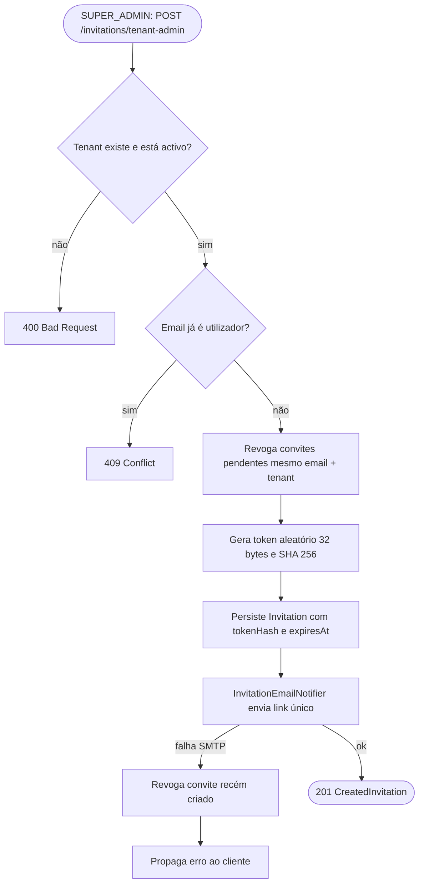
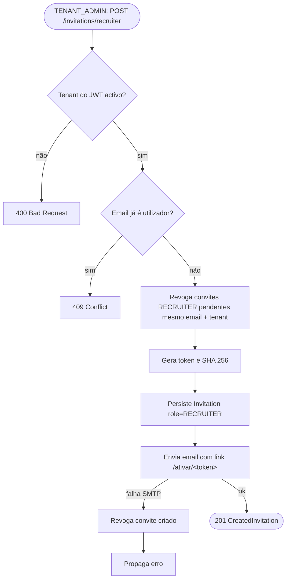
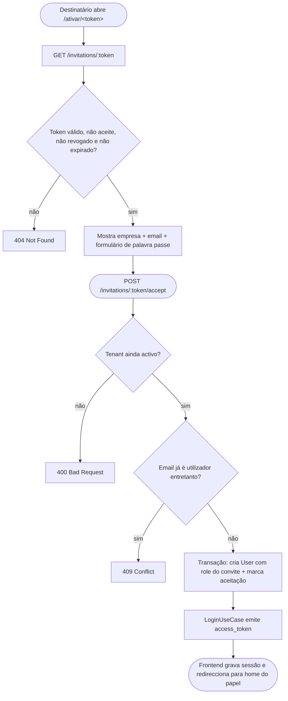
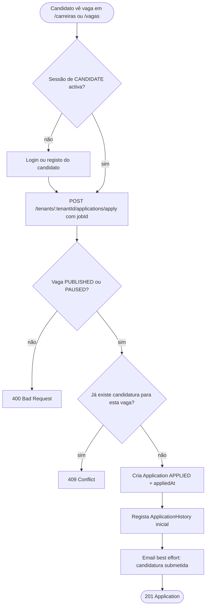
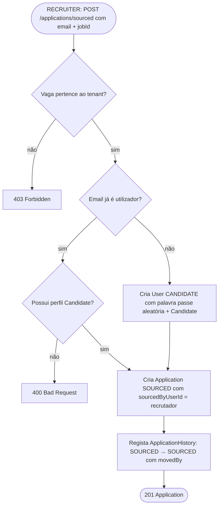
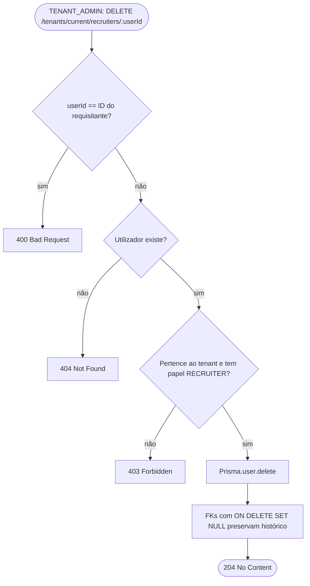
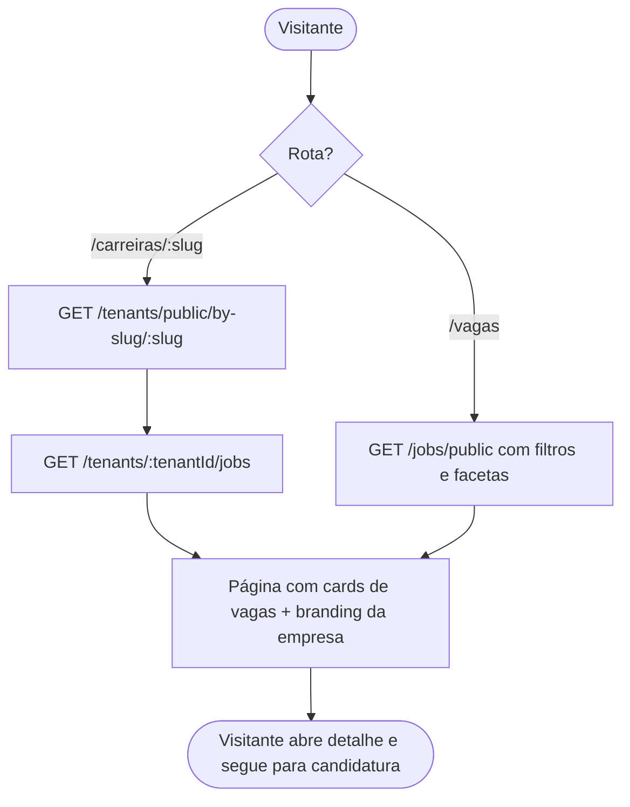

# Fluxos da Plataforma

> **Navegação:**
> - [Visão geral](./README.md)
> - [Funcionalidades e Regras de Negócio](./FUNCIONALIDADES.md)
> - [Modelo de Dados](./BANCO_DE_DADOS.md)
> - **Fluxos**

Conjunto de diagramas de fluxo (Mermaid `flowchart`) que descrevem os caminhos operacionais críticos do Deploy Talent. Cada secção foca um caso de uso ponta a ponta, identificando ramos felizes, validações e estados de erro relevantes na API. Para o ciclo de vida dos agregados (`Job.status`, `Application.status`) consulte o [Modelo de Dados](./BANCO_DE_DADOS.md).

## Autenticação e contexto B2B

Toda rota protegida valida o JWT, aplica RBAC pelo papel exigido e, quando a operação é *tenant scoped*, garante que o `tenantId` do token existe, está activo e é gravado no `AsyncLocalStorage` antes de chegar ao handler.

## Convite de admin de empresa

O `SUPER_ADMIN` provisiona empresas e convida o primeiro `TENANT_ADMIN`. O corpo do pedido nunca aceita palavra passe; o destinatário fá la na ativação.

## Convite de recrutador

O `TENANT_ADMIN` repete o mesmo padrão, mas o tenant vem implicitamente do JWT e o papel é `RECRUITER`.

## Activação de conta via convite

A página `/ativar/[token]` no frontend é pública. Faz pré visualização para mostrar empresa e email, depois aceita a palavra passe escolhida e devolve um JWT pronto.

## Upload com URL pré assinada

Ficheiros (currículos, avatares, logos, banners) entram no S3 por PUT directo com URL pré assinada e TTL curto. A API só guarda a chave do objecto; as leituras geram outra URL assinada de GET.

## Candidatura espontânea pelo candidato

O candidato aplica directamente a partir do site público de carreiras ou do marketplace. A vaga tem de estar a aceitar candidaturas e a entrada inicial é gravada no histórico.

## Sourcing pelo recrutador

O recrutador cria uma candidatura em nome de um candidato encontrado fora da plataforma. Se o email ainda não existir, a API provisiona `User` + `Candidate` com palavra passe aleatória para o candidato poder recuperar a conta mais tarde.

## Transição no pipeline de candidaturas

Cada movimento entre estados (`APPLIED → IN_PROGRESS → HIRED`, por exemplo) passa pelas regras da máquina de estados e regista a entrada de auditoria com o autor.

## Remoção de recrutador pelo tenant admin

Hard delete justificado pelo schema: as FKs em `applications`, `application_history`, `evaluations` e `invitations` usam `ON DELETE SET NULL`, preservando o histórico sem o nome do autor.

## Site público de carreiras e marketplace

O Next.js consome endpoints públicos para servir tanto o site dedicado de cada empresa (`/carreiras/[tenantId]/...`) como o marketplace agregado (`/vagas`). Ambos os caminhos terminam na candidatura espontânea descrita acima.

