# Fluxos da Plataforma

> **Navegação:**
> - [Visão geral](./README.md)
> - [Funcionalidades e Regras de Negócio](./FUNCIONALIDADES.md)
> - [Modelo de Dados](./BANCO_DE_DADOS.md)
> - **Fluxos**

Conjunto de diagramas de fluxo (Mermaid `flowchart`) que descrevem os caminhos operacionais críticos do Deploy Talent. Cada seção foca um caso de uso ponta a ponta, identificando ramos felizes, validações e estados de erro relevantes na API. Para o ciclo de vida dos agregados (`Job.status`, `Application.status`) consulte o [Modelo de Dados](./BANCO_DE_DADOS.md).

## Autenticação e contexto B2B

Toda rota protegida valida o JWT, aplica RBAC pelo papel exigido e, quando a operação é *tenant scoped*, garante que o `tenantId` do token existe, está ativo e é gravado no `AsyncLocalStorage` antes de chegar ao handler.

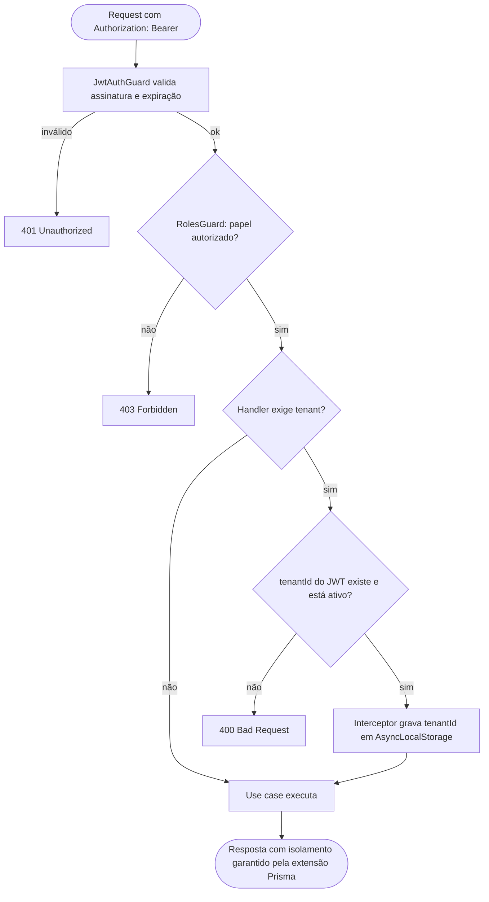

## Convite de admin de empresa

O `SUPER_ADMIN` provisiona empresas e convida o primeiro `TENANT_ADMIN`. O corpo do pedido nunca aceita senha; o destinatário faz isso na ativação.

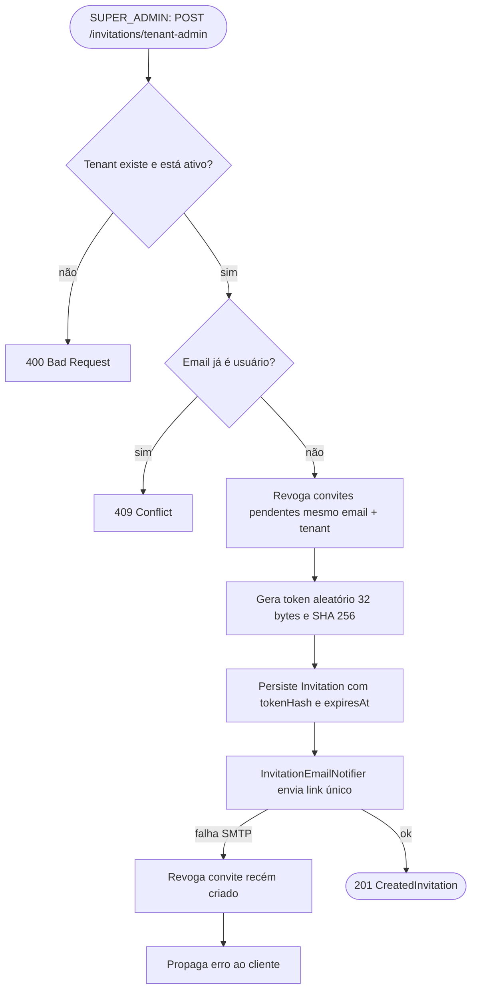

## Convite de recrutador

O `TENANT_ADMIN` repete o mesmo padrão, mas o tenant vem implicitamente do JWT e o papel é `RECRUITER`.

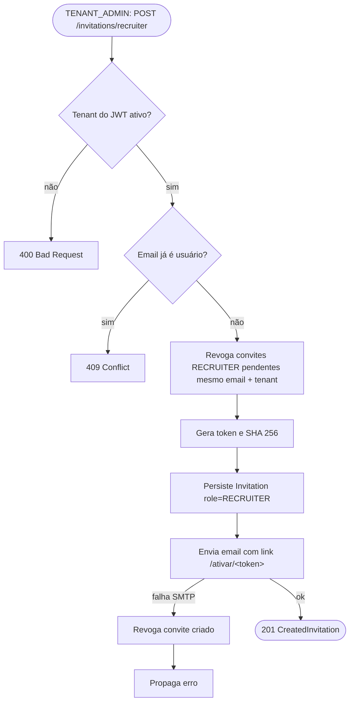

## Ativação de conta via convite

A página `/ativar/[token]` no frontend é pública. Faz prévia para mostrar nome, empresa (quando B2B) e email, depois aceita a senha escolhida e devolve um JWT pronto. Para convites `CANDIDATE` (sourcing) também é criado o `Candidate` na mesma transação.

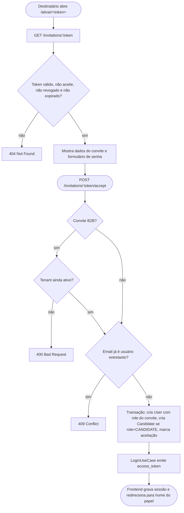

## Upload com URL pré assinada

Arquivos (currículos, avatares, logos, banners) entram no S3 por PUT direto com URL pré assinada e TTL curto. A API só guarda a chave do objeto; as leituras geram outra URL assinada de GET.

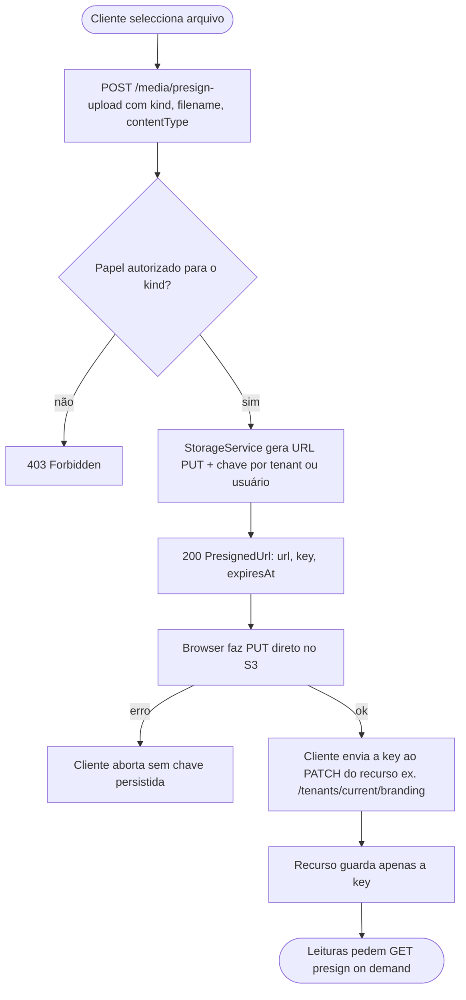

## Candidatura espontânea pelo candidato

O candidato aplica directamente a partir do site público de carreiras ou do marketplace. A vaga tem de estar a aceitar candidaturas e a entrada inicial é gravada no histórico.

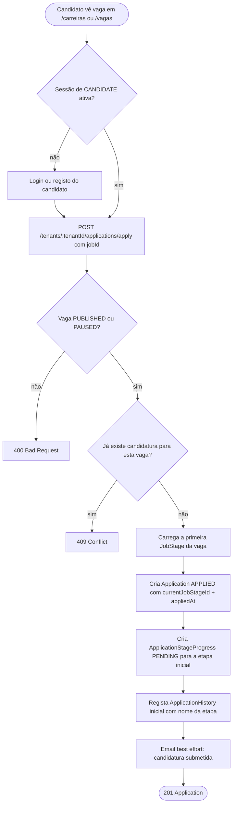

## Sourcing por email pelo recrutador

O recrutador faz prospecção por email a partir da vaga. A API decide o efeito a partir do estado do email na plataforma: convite para se cadastrar, email com link da vaga, ou nada se já existir candidatura. Nenhuma candidatura é criada pelo lado da empresa; o candidato submete `apply` quando quiser.

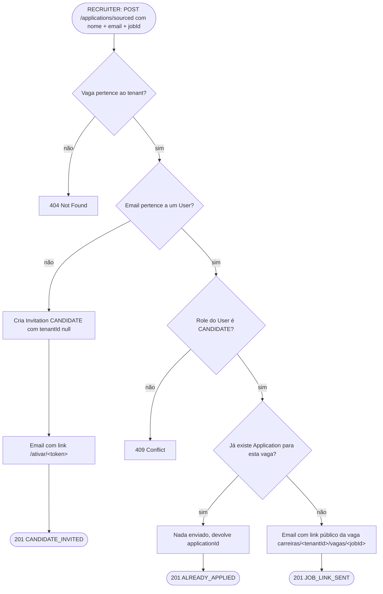

## Transição no pipeline de candidaturas

A pipeline tem dois eixos independentes: status macro (`/move`) e etapa customizável (`/stage`). O candidato vê e interage apenas com a etapa atual.

### Mudança de status macro

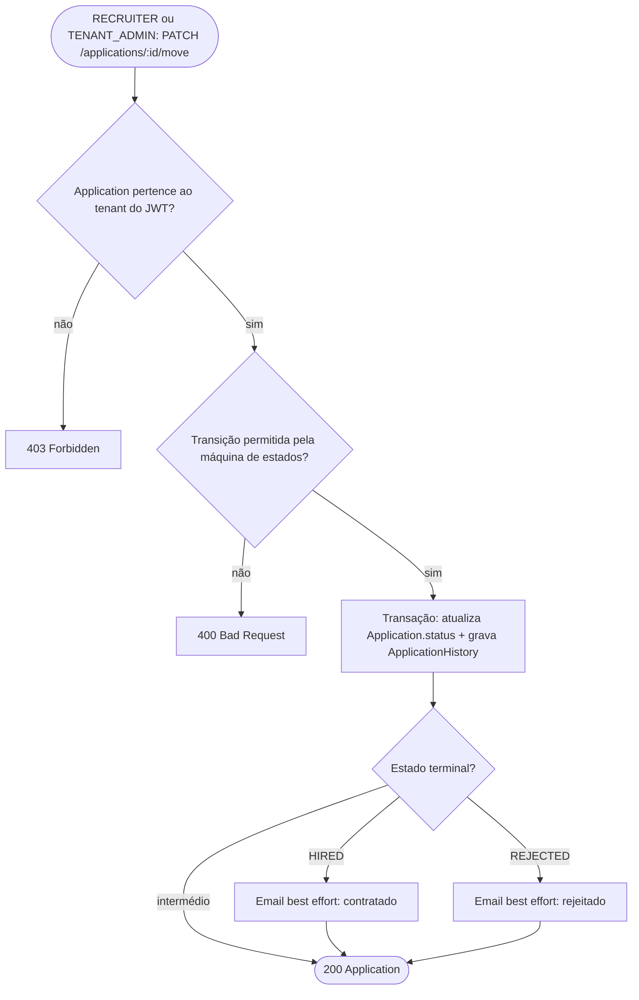

### Mover etapa da pipeline customizável

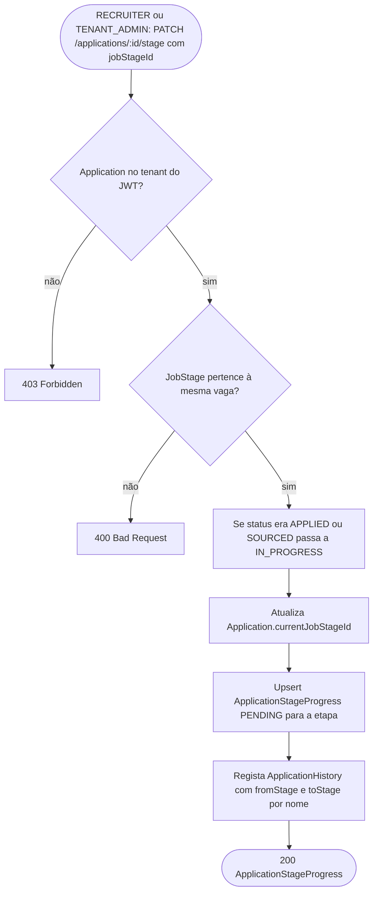

### Submissão do candidato na etapa atual

```mermaid
flowchart TD
    start([CANDIDATE: POST /applications/me/:id/currentStage/submit]) --> hasStage{currentJobStageId definido?}
    hasStage -- não --> err400b[400 Bad Request]
    hasStage -- sim --> alive{Status diferente de HIRED, REJECTED, WITHDRAWN?}
    alive -- não --> err400c[400 Bad Request]
    alive -- sim --> validate[validateStageSubmission(kind, config, payload)]
    validate -- erro --> err400d[400 Bad Request com detalhe]
    validate -- ok --> upsert[Upsert ApplicationStageProgress COMPLETED com submittedData e completedByUserId]
    upsert --> doneSubmit([200 ApplicationStageProgress])
```

### Recrutador define link de entrevista

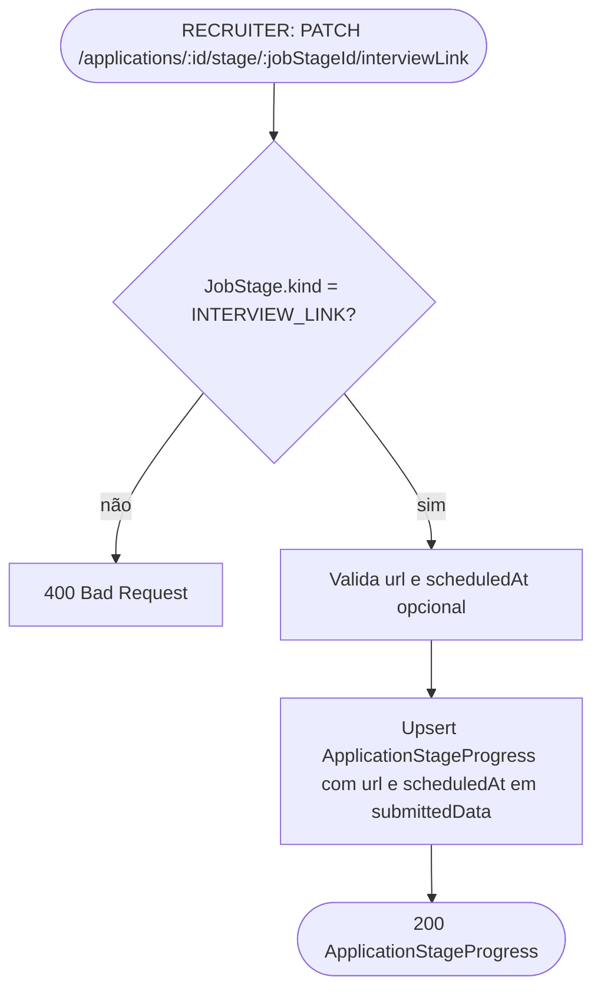

## Remoção de recrutador pelo tenant admin

Hard delete justificado pelo schema: as FKs em `applications`, `application_history` e `invitations` usam `ON DELETE SET NULL`, preservando o histórico sem o nome do autor.

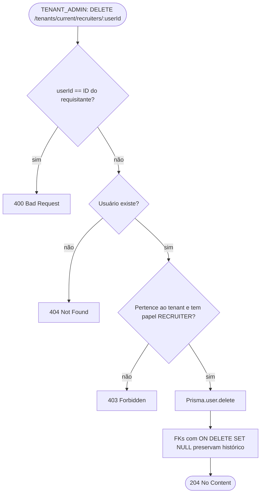

## Site público de carreiras e marketplace

O Next.js consome endpoints públicos para servir tanto o site dedicado de cada empresa (`/carreiras/[tenantId]/...`) como o marketplace agregado (`/vagas`). Ambos os caminhos terminam na candidatura espontânea descrita acima.


